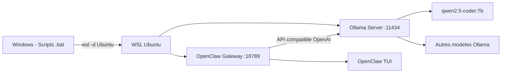

# Plan : Connecter OpenClaw aux modèles Ollama locaux

## Contexte
- **OpenClaw** v2026.3.2 est installé dans WSL Ubuntu (utilisateur `monssio`)
- **Ollama** est installé dans WSL Ubuntu avec le modèle `qwen2.5-coder:7b`
- La gateway OpenClaw tourne sur le port `18789`
- Le script `startup_openclaw_wsl.ps1` lance déjà Ollama (`ollama serve`) au démarrage

## Architecture



## Étapes

### 1. Explorer la configuration actuelle d'OpenClaw dans WSL
- Exécuter `wsl -d Ubuntu -u monssio bash -c "openclaw config show"` pour voir la config
- Chercher le fichier de config : `~/.config/openclaw/config.yaml` ou `~/.openclaw/`
- Lister les providers déjà configurés : `openclaw providers list`

### 2. Vérifier Ollama
- Confirmer qu'Ollama tourne : `wsl -d Ubuntu -u monssio bash -c "curl http://localhost:11434"`
- Lister les modèles disponibles : `wsl -d Ubuntu -u monssio bash -c "ollama list"`

### 3. Configurer OpenClaw pour Ollama
OpenClaw utilise la CLI pour configurer les providers. Les commandes attendues :

```bash
# Ajouter Ollama comme provider local
openclaw providers add ollama --base-url http://localhost:11434

# Définir le modèle par défaut
openclaw models set-default ollama/qwen2.5-coder:7b
```

Ou via le fichier de configuration YAML :

```yaml
providers:
  ollama:
    type: ollama
    base_url: http://localhost:11434
    
default_model: ollama/qwen2.5-coder:7b
```

### 4. Tester la connexion
- Lancer `openclaw tui` et envoyer un message de test
- Ou utiliser `openclaw chat "Bonjour, test de connexion"`

### 5. Mettre à jour les scripts si nécessaire
- S'assurer que `startup_openclaw_wsl.ps1` lance Ollama avant OpenClaw
- Vérifier que `open_chat.bat` utilise le bon modèle

## Notes
- Ollama expose une API compatible OpenAI sur `http://localhost:11434`
- OpenClaw peut détecter automatiquement les modèles Ollama via `openclaw models list --local`
- Le port 11434 est le port par défaut d'Ollama
